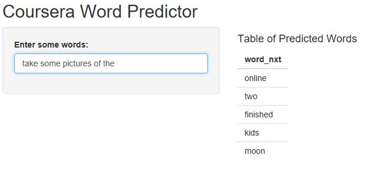

Coursera Data Science Capstone
========================================================
title: Word Prediction Model
author: Mike Hulin  
date:  August 2, 2018
autosize: true

Word Prediction Application
-----------------------------

Motivation
========================================================

Tiny Keyboards and large fingers do not go together.

- Mis-typing words on most mobile keyboards is frustrating 
- Speech recognition lacks privacy in public places
- Incorporating word prediction speeds up typing and increases message accuracy
- Reduces inconvenient auto-correct issues

Approach
========================================================

Using samples from three sources (Twitter, Blogs, and News) a model was created to use for the predictions.  To provide a diverse sample set, the ngrams were selected on frequency models for the entire data sources.  

Four models were created using the top 1-, 2-, 3-, and 4-word (ngrams) patterns in the samples.  

Prediction methodology
--------------------------------

A stupid back-off model is used to determine which ngram model to use.  Given an input string, the prediction model uses the last 3 words entered to search the 4-gram model.  If those words are not in the model, it backs off to the last 2 words and uses the 3-gram model. The model will continue to back off and check the 2-gram model, if no matches are present it then uses the top five words in the 1-gram model.

When matches are present, the top five values are displayed as the prediction.

Benefits
========================================================

The word prediction happens in real time as the user enters text into the application,  it returns the top five predictions for the phrase entered.

Providing this word prediction app in your product will help your users find common items that most people choose.  Mobile application benefit the most by improving input on tiny keyboards. 

Future Steps and Enhancements
========================================================

Continue to optimize the data model for increased performance in the Shiny App   
  - Add support for other languages  
  - Add additional features to the user Shiny User Interface  
    -- Selective number of predictions  
    -- Data visualization (i.e. wordcloud)  
    -- Dictionary Explorer  

Documentation and Links
------------------------------------------------------

Project Files on Github: [Word Prediction](https://github.com/pave-fe/DataScience_Capstone)

Shiny Demo Application: [Shiny App](https://pavefe.shinyapps.io/Word_predictor/)
