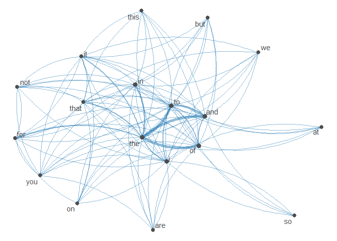
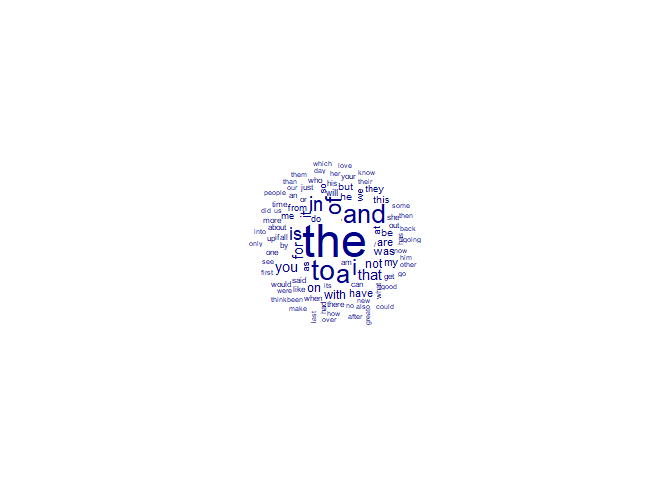
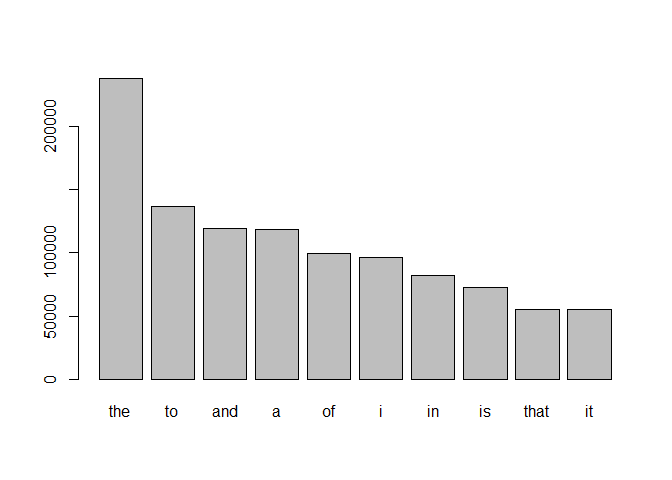
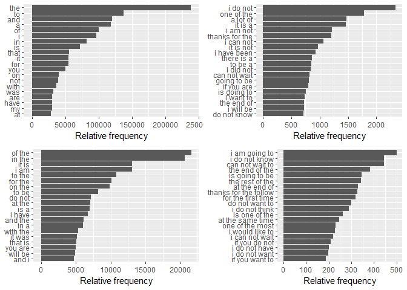
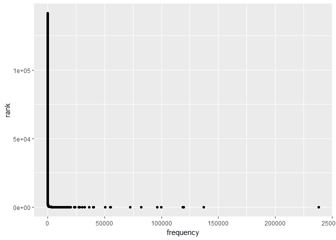
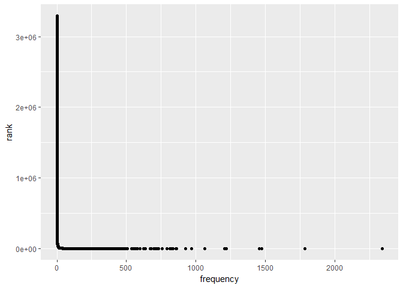

## Overview

This project consists of developing a predictive text model to determine the next word the user will type.
The model will be constructed by using text samples from 3 sources: Twitter, Blogs, and News reports. This milestone 
report will show the general make up of the sample files and the approach for building the model.


### Data Analysis Steps

1. Read in the data sources
2. Examine the data sources for size 
3. Reduce the size  and collate the data into one sample
  - involves data cleaning
4. Tokenize the data
5. Compute the term frequency for the sample 

Initially, I took the approach of using the tm and rweka packages for analysis by due to the size of the text samples, 
my computer could not process them without running into memory issues.   I have a very beefy computer, I7 processor with 64GB
of RAM.  

The Quanteda package was a great alternative and offered some unique features to help with preparing the data for the models.


### Data size

The following table is a good summary of the text files.   You can see that the total number of words for these data sets are about 100 million.   This count will be reduced through sampling and tokenization of the data.


```
##    source file.size.MB num.lines num.words max.line mean.num.words
## 1   blogs   248.493 Mb    899288  37546246    40833       41.75108
## 2    news   249.633 Mb   1010242  34762395    11384       34.40997
## 3 twitter   301.397 Mb   2360148  30093410      140       12.75065
```


### Sampling

After some testing I decided to use a 5% sample, the three samples are combined into one inclusive sample.


```r
####################  SAMPLING the Files ###############################

    ## Sampling Text files Function ###
sampletext <- function(textbody, portion) {
  keep <- sample(1:length(textbody), length(textbody)*portion)
  Sampletext <- textbody[keep]
  Sampletext
}

# sampling text files 
set.seed(62618)
portion <- 0.05
SampleTwitter <- sampletext(twitter, portion)
SampleBlog <- sampletext(blogs, portion)
SampleNews <- sampletext(news, portion)

# combine sampled texts into one variable
SampleAll <- c(SampleBlog, SampleNews, SampleTwitter)

# Clean up files
rm(SampleBlog, SampleNews, SampleTwitter, blogs, twitter, news)

# write sampled texts into text files for further analysis
# writeLines(SampleAll, "data/SampleAll.txt")

# sample.con <- file("~/Coursera/Capstone/Project/data/SampleAll.txt", open = "rb")
# SampleAll <- readLines(sample.con, skipNul = TRUE, encoding="UTF-8")
# close(sample.con); rm(sample.con)

# clean the sample text
s_clean <- clean_text(SampleAll)

# Save the file for quicker processing
# writeLines(s_clean, "~/Coursera/Capstone/Project/data/Sampleclean.txt")
```
Before additional cleaning, this sample contains 5102752 words.  Cleaning
removes  77331 words from the sample.  

For additional data analysis of the sample, I create a Document Frequency Matrix with the Quanteda package. 


```r
clean_dfm <- dfm(s_clean)
format(object.size(clean_dfm), "Mb", digits = 2)
```

```
## [1] "83.13 Mb"
```

The Quanteda package can use the DFM file to provide some text statistics.   It can show the relationship between the top 50 words in a Frequency Co-location Matrix.   This is not that interesting of a graph, since it shows the most common words used in the english language.   For the purpose of this task, I did not filter out these common "stop words" since the goal is word prediction.   Additionally, a wordcloud of the top words in the sample was also created.


```r
# Cool Map
new_fcm <- fcm(clean_dfm)
feat <- names(topfeatures(new_fcm, 50))
new_fcm <- fcm_select(new_fcm, feat)
dim(new_fcm)
```

```
## [1] 50 50
```

```r
size <- log(colSums(dfm_select(clean_dfm, feat)))
textplot_network(new_fcm, min_freq = 0.8, vertex_size = size / max(size) * 3)
```

<!-- -->

```r
textplot_wordcloud(clean_dfm, max_words = 100)
```

<!-- -->
### N-Gram Analysis

Analyzing the word frequency in the sample shows the expected top words.  These would be removed if standard text preparation was performed by removing common stopwords.   Since the goal is to make a next word prediction, I can't remove these from the sample.


```r
## ngrams using Quanteda package 
toks <- tokens(s_clean, remove_numbers = TRUE, remove_punct = TRUE,
               remove_symbols = TRUE, remove_separators = TRUE,
               remove_twitter = TRUE, remove_hyphens = TRUE, remove_url = TRUE,
               ngrams = 1, concatenator = " ")

ngram_dfm <- dfm(toks)
ngram_dfm <- dfm_sort(ngram_dfm, decreasing = T)
head(docfreq(ngram_dfm))
```

```
##    the     to    and      a     of      i 
## 101812  81538  69656  72555  60018  54844
```

```r
barplot(head(topfeatures(ngram_dfm), 20))
```

<!-- -->


I created 1, 2, 3, and 4 grams from the sample and plotted the most frequent terms.


```r
## ngrams using Quanteda package 
plot_ngram <- function (x, ngram_size=1) {
  ngram_plot <- x %>%
  tokens(remove_numbers = TRUE, remove_punct = TRUE,
               remove_symbols = TRUE, remove_separators = TRUE,
               remove_twitter = TRUE, remove_hyphens = TRUE, remove_url = TRUE,
               ngrams = ngram_size, concatenator = " ") %>%
  dfm() %>%
  dfm_sort(decreasing = T) %>%
  topfeatures( 20) 
  ## convert results to a data frame
  dat <- data.frame(term = names(ngram_plot), value =ngram_plot, row.names=NULL) 
  
  ggplot(data = dat,  aes(x = reorder(term,value), y = value)) +
    geom_bar(stat = "identity") +
    coord_flip() +
    labs(x = NULL, y = "Relative frequency")

}

p1 <- plot_ngram(s_clean, 1)
p2 <- plot_ngram(s_clean, 2)
p3 <- plot_ngram(s_clean, 3)
p4 <- plot_ngram(s_clean, 4)

multiplot(p1, p2, p3, p4,  cols = 2)
```

<!-- -->

Eventually the prediction model will take into account the frequency that each word occurs in the sample.  It would be good to know how many words only occur once in the sample.   Analysis was performed to determine these stats for 1-gram and 3-gram sets of data.

```r
## find the single occurances of words

find_unigram <- function (x, ngram_size=1) {
  ngram_plot <- x %>%
  tokens(remove_numbers = TRUE, remove_punct = TRUE,
               remove_symbols = TRUE, remove_separators = TRUE,
               remove_twitter = TRUE, remove_hyphens = TRUE, remove_url = TRUE,
               ngrams = ngram_size, concatenator = " ") %>%
  dfm() %>%
  dfm_sort(decreasing = F)
}

freq <- textstat_frequency(find_unigram(s_clean, 1))  

ggplot(freq, aes(x=frequency, y=rank)) + geom_point()
```

<!-- -->
This plot shows the distribution of the sorted frequency matrix of unigrams in the sample.  It show that a majority of the unigrams occur very infrequently.

In the sample there are 79095  samples that occur only once.  This accounts for
55.8821244 percent of the total.  


```r
x <- cut(freq$frequency, 3, include.lowest = TRUE, labels=c("Low", "Med", "High"))
table(x)
```

```
## x
##    Low    Med   High 
## 141532      6      1
```
Using the 'cut' function and dividing the frequencies into three buckets, gives another view of the skewed distribution.

 


```r
freq <- textstat_frequency(find_unigram(s_clean, 3))  

ggplot(freq, aes(x=frequency, y=rank)) + geom_point()
```

<!-- -->

```r
x <- cut(freq$frequency, 3, include.lowest = TRUE, labels=c("Low", "Med", "High"))
table(x)
```

```
## x
##     Low     Med    High 
## 3291937      13       2
```
Plotting the tri-grams results in basically the same distribution.  In the sample there are 2943727  samples that occur only once.  This accounts for
89.4219296 percent of the total.   


### Word Coverage

The github repository is useful as a corpus for typing training programs. According to analysis of the Oxford English Corpus, the 7,000 most common English lemmas account for approximately 90% of usage, so a 10,000 word training corpus is more than sufficient for practical training applications.

To check the coverage of my sample, I am using a 10,000 word corpus found here:  https://github.com/first20hours/google-10000-english/blob/master/google-10000-english-usa.txt

To check the coverage of the 5% sample.  I used the dfm_keep package and kept only the words in the Google 10,000 word list.  Additionaly processing with textstat_frequency, resulted in a term frequency for the Top 10K google words.


```r
len.s_clean <- length(s_clean)
my_dict <- readr::read_table("https://raw.githubusercontent.com/first20hours/google-10000-english/master/google-10000-english-usa.txt", col_names = F)
```

```
## Parsed with column specification:
## cols(
##   X1 = col_character()
## )
```

```r
popword <- as.list(my_dict$X1)

goodwords <- quanteda::dfm_keep(clean_dfm, popword)  
gw.freq <- textstat_frequency(goodwords)
summary(gw.freq$frequency)
```

```
##     Min.  1st Qu.   Median     Mean  3rd Qu.     Max. 
##      1.0     28.0     72.0    457.2    193.0 238128.0
```

The current sample covers 9767 words.   I am confident in this sample containing enough words to build the model with in the next stages.

### Future Steps

Model selection will most likely be the generation of n-grams and using a back off model to predict the next word.


